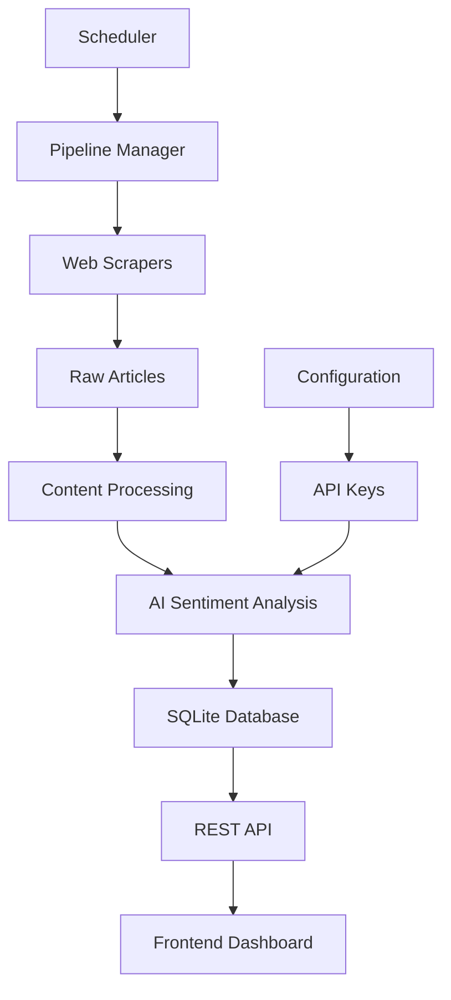
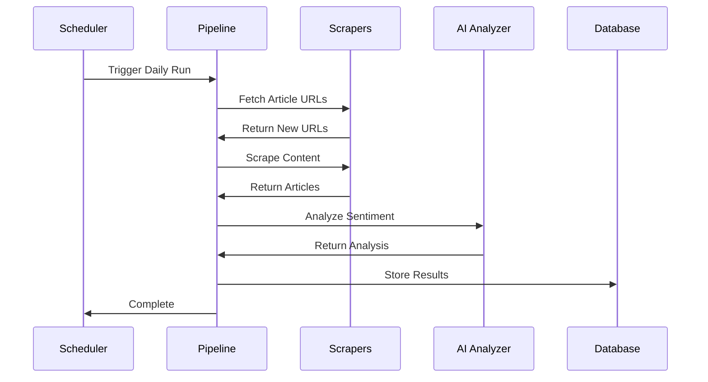

# 🚀 SentiNews Server

<div align="center">


**AI-Powered Financial News Sentiment Analysis Backend**

[](https://python.org)
[](https://flask.palletsprojects.com)
[](https://sqlite.org)
[](https://openai.com)
[](https://langchain.com)

</div>

---

## 📋 Table of Contents

- [🌟 Overview](#-overview)
- [✨ Features](#-features)
- [🏗️ Architecture](#️-architecture)
- [🚀 Quick Start](#-quick-start)
- [📁 Project Structure](#-project-structure)
- [🔧 Configuration](#-configuration)
- [📊 API Endpoints](#-api-endpoints)
- [🤖 AI Models](#-ai-models)
- [🕷️ Web Scrapers](#️-web-scrapers)
- [📈 Pipeline Management](#-pipeline-management)
- [🔒 Security](#-security)
- [📚 Usage Examples](#-usage-examples)
- [🛠️ Development](#️-development)
- [🐛 Troubleshooting](#-troubleshooting)
- [📄 License](#-license)

---

## 🌟 Overview

SentiNews Server is a sophisticated backend system that powers financial news sentiment analysis using cutting-edge AI technology. It automatically scrapes financial news from multiple sources, analyzes sentiment using advanced language models, and provides comprehensive APIs for accessing insights.

### 🎯 Key Capabilities

- **🔍 Intelligent News Scraping**: Automated collection from multiple financial news sources
- **🧠 Dual Sentiment Analysis**: Separate financial and overall sentiment scoring
- **🏢 Entity Recognition**: Automatic detection of companies and cryptocurrencies
- **📊 Real-time Analytics**: Live sentiment tracking and trend analysis
- **🔄 Automated Pipelines**: Scheduled data collection and analysis
- **🌐 RESTful API**: Comprehensive endpoints for data access

---

## ✨ Features

### 🤖 AI-Powered Analysis
- **Multi-Model Support**: OpenAI GPT-4 and Groq Llama integration
- **Structured Output**: Pydantic-validated sentiment analysis
- **Cost Tracking**: Detailed usage and cost monitoring
- **Retry Logic**: Robust error handling and recovery

### 🕷️ Advanced Web Scraping
- **Dynamic Scraper Management**: Modular scraper architecture
- **Multiple Sources**: Zawya, MENAbytes, and extensible framework
- **Content Extraction**: Clean text extraction and preprocessing
- **Duplicate Prevention**: Intelligent deduplication

### 📊 Data Management
- **SQLite Database**: Efficient local storage
- **Structured Schema**: Optimized for analytics queries
- **Data Integrity**: Foreign key constraints and validation
- **Migration Support**: Schema evolution capabilities

### 🔄 Pipeline Automation
- **Scheduled Execution**: Configurable daily runs
- **Real-time Status**: Live pipeline monitoring
- **Graceful Shutdown**: Safe interruption handling
- **Progress Tracking**: Detailed execution metrics

---

## 🏗️ Architecture



### 🧩 Core Components

| Component | Description | Technology |
|-----------|-------------|------------|
| **API Server** | RESTful endpoints and request handling | Flask + CORS |
| **Sentiment Analyzer** | AI-powered sentiment analysis engine | LangChain + OpenAI/Groq |
| **Scraper Manager** | Dynamic web scraper orchestration | Requests + BeautifulSoup |
| **Database Layer** | Data persistence and retrieval | SQLite3 |
| **Pipeline Engine** | Automated data processing workflows | APScheduler |
| **Configuration** | Environment and runtime settings | Python-dotenv |

---

## 🚀 Quick Start

### 📋 Prerequisites

```bash
# Python 3.8 or higher
python --version

# pip package manager
pip --version
```

### ⚡ Installation

1. **Clone and Navigate**
   ```bash
   git clone <repository-url>
   cd server
   ```

2. **Install Dependencies**
   ```bash
   pip install -r requirements.txt
   ```

3. **Environment Setup**
   ```bash
   # Create .env file
   cp .env.example .env
   
   # Edit with your API keys
   nano .env
   ```

4. **Initialize Database**
   ```bash
   python -c "import database; database.create_database()"
   ```

5. **Start Server**
   ```bash
   python api.py
   ```

### 🌐 Verify Installation

```bash
# Test API health
curl http://localhost:5000/

# Check available scrapers
curl http://localhost:5000/api/scrapers

# View pipeline status
curl http://localhost:5000/api/pipeline_status
```

---

## 📁 Project Structure

```
server/
├── 📄 api.py                    # Main Flask application
├── 📄 database.py               # Database operations
├── 📄 pipeline.py               # Data processing pipelines
├── 📄 main.py                   # CLI entry point
├── 📄 requirements.txt          # Python dependencies
├── 📄 .env.example              # Environment template
├── 📄 README.md                 # This file
│
├── 📁 analysis/                 # AI analysis modules
│   ├── 📄 __init__.py
│   └── 📄 sentiment_analyzer.py # Core sentiment analysis
│
└── 📁 scrapers/                 # Web scraping modules
    ├── 📄 __init__.py
    ├── 📄 scraper_manager.py    # Dynamic scraper management
    ├── 📄 zawya_scraper.py      # Zawya.com scraper
    └── 📄 menabytes_scraper.py  # MENAbytes.com scraper
```

---

## 🔧 Configuration

### 🔑 Environment Variables

Create a `.env` file in the server directory:

```env
# AI Model Configuration
OPENAI_API_KEY=your_openai_api_key_here
GROQ_API_KEY=your_groq_api_key_here

# Pipeline Security
PIPELINE_PASSWORD=your_secure_pipeline_password

# Optional: Model Preferences
DEFAULT_LLM_PROVIDER=openai
DEFAULT_OPENAI_MODEL=gpt-4o-mini
DEFAULT_GROQ_MODEL=llama3-8b-8192
```

### ⚙️ Runtime Configuration

| Setting | Default | Description |
|---------|---------|-------------|
| `schedule_time` | `01:00` | Daily pipeline execution time (UTC) |
| `max_retries` | `3` | AI analysis retry attempts |
| `cache_duration` | `300` | Response cache time (seconds) |
| `rate_limit` | `100/hour` | API request rate limiting |

---

## 📊 API Endpoints

### 🏠 Core Endpoints

#### `GET /` - API Information
```json
{
  "message": "Welcome to the Financial News Sentiment API",
  "endpoints": { ... }
}
```

#### `GET /api/scrapers` - Available Scrapers
```json
["zawya.com", "menabytes.com"]
```

### 🔄 Pipeline Management

#### `POST /api/trigger_pipeline` - Start Pipeline
```bash
curl -X POST http://localhost:5000/api/trigger_pipeline \
  -H "Content-Type: application/json" \
  -d '{
    "password": "your_password",
    "provider": "openai",
    "model_name": "gpt-4o-mini",
    "scrapers": ["zawya.com", "menabytes.com"]
  }'
```

#### `GET /api/pipeline_status` - Pipeline Status
```json
{
  "is_running": true,
  "status": "Analyzing sentiment",
  "progress": 15,
  "total": 50,
  "current_task": "Analyzing article ID: 123"
}
```

#### `POST /api/stop_pipeline` - Stop Pipeline
```bash
curl -X POST http://localhost:5000/api/stop_pipeline \
  -H "Content-Type: application/json" \
  -d '{"password": "your_password"}'
```

### 📰 Data Access

#### `GET /api/articles` - Fetch Articles
```bash
# All articles
curl "http://localhost:5000/api/articles"

# Filtered articles
curl "http://localhost:5000/api/articles?entity_name=Apple&entity_type=company&limit=10"
```

#### `GET /api/entities` - List Entities
```json
[
  {"entity_name": "Apple", "entity_type": "company"},
  {"entity_name": "Bitcoin", "entity_type": "crypto"}
]
```

#### `GET /api/top_entities` - Top Entities by Sentiment
```bash
curl "http://localhost:5000/api/top_entities?sentiment_type=overall&sentiment=positive&limit=10"
```

### 📈 Analytics

#### `GET /api/sentiment_over_time` - Sentiment Trends
```bash
curl "http://localhost:5000/api/sentiment_over_time?entity_name=Tesla"
```

#### `GET /api/dashboard_stats` - Dashboard Statistics
```json
{
  "total_entities": 150,
  "articles_analyzed": 1250,
  "total_sentiment_points": 2100,
  "sentiment_distribution": {
    "positive": 800,
    "negative": 600,
    "neutral": 700
  }
}
```

#### `GET /api/summarize_entity` - AI Entity Summary
```bash
curl "http://localhost:5000/api/summarize_entity?entity_name=Apple"
```

### 📊 Usage Analytics

#### `GET /api/usage_stats` - API Usage Statistics
```bash
# Detailed logs
curl "http://localhost:5000/api/usage_stats"

# Summary by provider
curl "http://localhost:5000/api/usage_stats?summarize=true"
```

---

## 🤖 AI Models

### 🧠 Supported Providers

#### OpenAI Integration
- **Models**: GPT-4, GPT-4-turbo, GPT-4o-mini
- **Features**: Structured output, cost tracking, rate limiting
- **Use Case**: High-accuracy sentiment analysis

#### Groq Integration  
- **Models**: Llama3-8b-8192, Mixtral-8x7b
- **Features**: Fast inference, cost-effective
- **Use Case**: High-volume processing

### 📝 Sentiment Analysis Schema

```python
class EntitySentiment(BaseModel):
    entity_name: str          # Full company/crypto name
    entity_type: str          # "company" or "crypto"
    financial_sentiment: str  # "positive", "negative", "neutral"
    overall_sentiment: str    # "positive", "negative", "neutral"
    reasoning: str           # AI explanation
```

### 💰 Cost Optimization

- **Token Usage Tracking**: Real-time monitoring
- **Model Selection**: Automatic cost-performance optimization
- **Batch Processing**: Efficient API usage
- **Retry Logic**: Minimize failed requests

---

## 🕷️ Web Scrapers

### 🏗️ Scraper Architecture

Each scraper module implements:
- `SOURCE_NAME`: Unique identifier
- `get_article_urls()`: URL discovery
- `scrape_article_content(url)`: Content extraction

### 📰 Supported Sources

#### Zawya.com Scraper
```python
# Features
- Business news focus
- Arabic/English content
- Author attribution
- Publication dates
- Clean text extraction
```

#### MENAbytes.com Scraper
```python
# Features  
- MENA tech/business news
- Startup coverage
- Investment news
- Clean content parsing
```

### 🔧 Adding New Scrapers

1. **Create Scraper Module**
   ```python
   # scrapers/newsource_scraper.py
   SOURCE_NAME = "newsource.com"
   
   def get_article_urls():
       # Implementation
       return urls
   
   def scrape_article_content(url):
       # Implementation
       return article_data
   ```

2. **Auto-Discovery**
   - Place in `scrapers/` directory
   - Follow naming convention: `*_scraper.py`
   - Implement required functions

3. **Test Integration**
   ```bash
   curl http://localhost:5000/api/scrapers
   ```

---

## 📈 Pipeline Management

### 🔄 Pipeline Workflow



### ⏰ Scheduling

```python
# Configure schedule
POST /api/configure_schedule
{
  "password": "your_password",
  "schedule_time": "02:30"  # UTC time
}
```

### 📊 Monitoring

```python
# Real-time status
GET /api/pipeline_status

# Historical runs
GET /api/pipeline_last_run
```

### 🛑 Control Operations

```python
# Manual trigger
POST /api/trigger_pipeline

# Graceful stop
POST /api/stop_pipeline

# Status check
GET /api/pipeline_status
```

---

## 🔒 Security

### 🔐 Authentication

- **Pipeline Operations**: Password-protected endpoints
- **API Keys**: Secure environment variable storage
- **Rate Limiting**: Request throttling (planned)

### 🛡️ Data Protection

- **Input Validation**: Pydantic schema validation
- **SQL Injection**: Parameterized queries
- **CORS**: Configurable cross-origin policies
- **Error Handling**: Secure error responses

### 🔑 Best Practices

```bash
# Strong passwords
PIPELINE_PASSWORD=your_very_secure_password_here

# API key rotation
OPENAI_API_KEY=sk-...  # Rotate regularly

# Environment isolation
# Never commit .env files
echo ".env" >> .gitignore
```

---

## 📚 Usage Examples

### 🚀 Basic Pipeline Run

```python
import requests

# Trigger analysis
response = requests.post('http://localhost:5000/api/trigger_pipeline', 
    json={
        'password': 'your_password',
        'provider': 'openai',
        'scrapers': ['zawya.com']
    }
)

# Monitor progress
while True:
    status = requests.get('http://localhost:5000/api/pipeline_status').json()
    print(f"Status: {status['status']} ({status['progress']}/{status['total']})")
    if not status['is_running']:
        break
    time.sleep(5)
```

### 📊 Data Analysis

```python
# Get sentiment trends
trends = requests.get('http://localhost:5000/api/sentiment_over_time', 
    params={'entity_name': 'Apple'}).json()

# Analyze top performers
top_positive = requests.get('http://localhost:5000/api/top_entities',
    params={
        'sentiment_type': 'financial',
        'sentiment': 'positive',
        'limit': 10
    }).json()

# Generate AI summary
summary = requests.get('http://localhost:5000/api/summarize_entity',
    params={'entity_name': 'Tesla'}).json()
```

### 🔍 Custom Queries

```python
# Filter articles by multiple criteria
articles = requests.get('http://localhost:5000/api/articles', 
    params={
        'entity_type': 'crypto',
        'financial_sentiment': 'positive',
        'limit': 20
    }).json()

# Get entity-specific articles
entity_articles = requests.get('http://localhost:5000/api/entity_articles_by_sentiment',
    params={
        'entity_name': 'Bitcoin',
        'entity_type': 'crypto'
    }).json()
```

---

## 🛠️ Development

### 🧪 Testing

```bash
# Run basic tests
python -m pytest tests/

# Test specific scraper
python -c "from scrapers import zawya_scraper; print(zawya_scraper.get_article_urls())"

# Test sentiment analysis
python -c "from analysis.sentiment_analyzer import SentimentAnalyzer; analyzer = SentimentAnalyzer(); print(analyzer.analyze_text_for_sentiment('Apple stock rises on strong earnings.'))"
```

### 🔧 Development Setup

```bash
# Install development dependencies
pip install -r requirements-dev.txt

# Enable debug mode
export FLASK_ENV=development
export FLASK_DEBUG=1

# Run with auto-reload
python api.py
```

### 📝 Code Style

```bash
# Format code
black .

# Lint code  
flake8 .

# Type checking
mypy .
```

### 🐛 Debugging

```python
# Enable verbose logging
import logging
logging.basicConfig(level=logging.DEBUG)

# Database inspection
sqlite3 news_data.db
.tables
.schema articles
SELECT COUNT(*) FROM articles;
```

---

## 🐛 Troubleshooting

### ❌ Common Issues

#### Database Errors
```bash
# Reset database
rm news_data.db
python -c "import database; database.create_database()"
```

#### API Key Issues
```bash
# Verify API keys
python -c "import os; from dotenv import load_dotenv; load_dotenv(); print('OpenAI:', bool(os.getenv('OPENAI_API_KEY'))); print('Groq:', bool(os.getenv('GROQ_API_KEY')))"
```

#### Scraper Failures
```bash
# Test individual scrapers
python -c "from scrapers.zawya_scraper import get_article_urls; print(len(get_article_urls()))"
```

#### Memory Issues
```bash
# Monitor memory usage
pip install psutil
python -c "import psutil; print(f'Memory: {psutil.virtual_memory().percent}%')"
```

### 🔍 Debug Mode

```python
# Enable detailed logging
import logging
logging.basicConfig(
    level=logging.DEBUG,
    format='%(asctime)s - %(name)s - %(levelname)s - %(message)s'
)
```

### 📞 Support

- **Issues**: Create GitHub issue with logs
- **Features**: Submit feature request
- **Documentation**: Contribute improvements

---

## 📈 Performance Metrics

### 🚀 Benchmarks

| Metric | Value | Notes |
|--------|-------|-------|
| **Articles/Hour** | ~500 | With parallel processing |
| **Analysis Speed** | ~2s/article | GPT-4o-mini average |
| **Memory Usage** | ~200MB | Typical operation |
| **Database Size** | ~50MB | Per 10K articles |

### 📊 Optimization Tips

- **Batch Processing**: Group API calls
- **Caching**: Enable response caching
- **Model Selection**: Use appropriate AI model
- **Parallel Scrapers**: Run multiple scrapers

---

## 🔮 Roadmap

### 🎯 Upcoming Features

- [ ] **Real-time Streaming**: WebSocket support
- [ ] **Advanced Analytics**: ML trend prediction  
- [ ] **Multi-language**: Support for Arabic content
- [ ] **API Authentication**: JWT token system
- [ ] **Horizontal Scaling**: Redis clustering
- [ ] **Advanced Scrapers**: Social media integration

### 🚀 Performance Improvements

- [ ] **Async Processing**: FastAPI migration
- [ ] **Database Optimization**: PostgreSQL support
- [ ] **Caching Layer**: Redis integration
- [ ] **Load Balancing**: Multi-instance support

---

## 📄 License

This project is licensed under the MIT License - see the [LICENSE](LICENSE) file for details.

---

<div align="center">

**Built with ❤️ for Financial Intelligence**

[](https://github.com/your-repo)
[](https://docs.your-domain.com)
[](http://localhost:5000/)

</div>